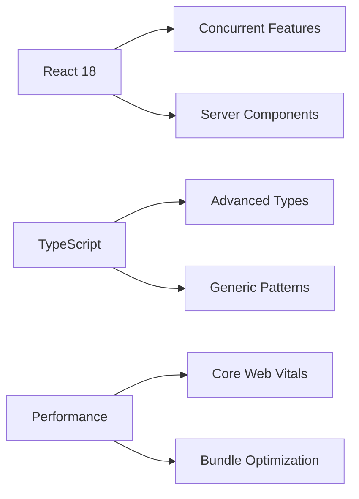

# 🌟 Frontend Learning Hub
> **프론트엔드 기술 탐구와 실전 프로젝트 저장소**

CS 지식과 실무 경험을 연결하는 프론트엔드 개발 여정을 기록합니다.  
각 기술의 원리를 이해하고, 실제 프로젝트에 적용하는 과정을 체계적으로 정리했습니다.

---

## 🎯 Learning Philosophy

**"이론과 실무의 연결고리를 만들어가는 개발자"**

- 📚 **Deep Dive**: 기술의 내부 동작 원리 이해
- 🛠 **Hands-on**: 학습 내용을 실제 프로젝트에 적용
- 🔄 **Iteration**: 지속적인 개선과 리팩토링
- 📝 **Documentation**: 학습 과정과 문제 해결 방법 기록

---

## 🗂 Repository Structure

```
web_FE/
├── 📁 learning/           # 기술별 학습 내용
│   ├── react/            # React 심화 학습
│   ├── typescript/       # TypeScript 고급 패턴
│   ├── performance/      # 웹 성능 최적화
│   └── accessibility/    # 웹 접근성 가이드
├── 📁 projects/          # 실전 프로젝트
│   ├── production/       # 실제 서비스 프로젝트
│   ├── experiments/      # 기술 검증 프로젝트
│   └── contributions/    # 오픈소스 기여
└── 📁 resources/         # 개발 리소스
    ├── templates/        # 재사용 가능한 템플릿
    ├── utils/           # 유틸리티 함수
    └── docs/            # 기술 문서
```

---

## 🛠 Technology Deep Dive

### ⚛️ React Ecosystem
#### 🎯 현재 학습 상태: **Advanced**

**핵심 학습 내용:**
- [**React 18 Concurrent Features**](./learning/react/concurrent-features.md)
  - Suspense, useDeferredValue, useTransition 실전 적용
  - 렌더링 최적화로 사용자 경험 개선
  
- [**Custom Hooks 설계 패턴**](./learning/react/custom-hooks.md)
  - 재사용 가능한 로직 추상화
  - 테스트 가능한 Hook 설계 방법론

- [**React Performance Optimization**](./learning/react/performance.md)
  - React DevTools Profiler 활용한 성능 분석
  - 메모이제이션 전략과 불필요한 리렌더링 방지

**적용 프로젝트:**
- 🏥 [의약품 복용 관리 플랫폼](https://github.com/davJ-star/hanwha-ieum-seongwook) - React 18 + TypeScript
- 📝 [씨앗 게시판](https://github.com/siat-blog/siat9-blog) - React + Redux Toolkit

---

### 🔷 TypeScript Mastery
#### 🎯 현재 학습 상태: **Intermediate → Advanced**

**학습 진행 현황:**
- [x] **기본 타입 시스템** - 완료
- [x] **Generic 및 유틸리티 타입** - 완료  
- [🔄] **고급 타입 패턴** - 진행 중
- [⏳] **타입 레벨 프로그래밍** - 계획 중

**심화 학습 내용:**
```typescript
// 실제 프로젝트에서 활용한 고급 타입 패턴
type APIResponse<T> = {
  data: T;
  status: 'success' | 'error';
  message?: string;
};

// 조건부 타입을 활용한 API 응답 타입 안전성 확보
type SafeAPICall<T> = T extends string 
  ? APIResponse<string>
  : T extends number
  ? APIResponse<number>
  : APIResponse<unknown>;
```

**적용 사례:**
- [타입 안전한 API 클라이언트 구현](./learning/typescript/api-client.md)
- [Redux 상태의 타입 안전성 확보](./learning/typescript/redux-types.md)

---

### ⚡ Next.js Full-Stack Development  
#### 🎯 현재 학습 상태: **Intermediate**

**학습 목표:**
- SSR/SSG 최적화를 통한 성능 향상
- App Router 기반 모던 Next.js 패턴 습득
- 풀스택 개발 역량 강화

**실전 프로젝트:**
- 🎯 [AI 기반 출석 관리](https://github.com/davJ-star/attendance-management-nextjs) - Next.js + Django
- 🛒 [E-commerce Platform](https://github.com/davJ-star/nextjs-commerce) - Next.js 13 App Router

**학습 포인트:**
- [Server Components vs Client Components 활용법](./learning/nextjs/server-client-components.md)
- [Dynamic Route 및 Metadata API 최적화](./learning/nextjs/seo-optimization.md)

---

### 🎨 Modern CSS & Styling

**학습 기술 스택:**
- **CSS-in-JS**: Styled-components, Emotion
- **CSS Modules**: 스타일 격리 및 네이밍 전략
- **Utility-First**: Tailwind CSS 활용법
- **Design System**: 일관성 있는 컴포넌트 설계

**실제 적용 사례:**
```typescript
// Atomic Design 패턴 + Styled-components 조합
const Button = styled.button<ButtonProps>`
  ${({ theme, variant, size }) => css`
    ${theme.button[variant]}
    ${theme.button.sizes[size]}
    transition: all 0.2s ease-in-out;
    
    &:hover {
      transform: translateY(-1px);
    }
  `}
`;
```

---

## 🚀 Featured Projects

### 🏆 Production Projects

| Project | Description | Tech Stack | Status | Link |
|---------|-------------|------------|--------|------|
| **의약품 복용 관리** | AI 기반 복약 관리 시스템 | React, TS, FastAPI | 🟢 **운영중** | [GitHub](https://github.com/davJ-star/hanwha-ieum-seongwook) |
| **씨앗 게시판** | 실사용자 개발자 커뮤니티 | React, Redux, Spring | 🟢 **운영중** | [GitHub](https://github.com/siat-blog/siat9-blog) |
| **AI 출석 관리** | 얼굴인식 출석 시스템 | Next.js, Django, AI | ✅ **완료** | [GitHub](https://github.com/davJ-star/attendance-management-nextjs) |

### 🧪 Experimental Projects

| Project | Learning Goal | Tech Focus | Progress |
|---------|---------------|------------|----------|
| **React Playground** | 최신 React 패턴 실험 | Concurrent Features | 🔄 **진행중** |
| **TypeScript Utils** | 고급 타입 시스템 구현 | Type-level Programming | 🔄 **진행중** |
| **Performance Lab** | 웹 성능 최적화 연구 | Core Web Vitals | ⏳ **계획중** |

---

## 📊 Learning Progress

### 🎯 Current Focus Areas



### 📈 Skill Development Timeline

**2024년 학습 성과:**
- ✅ **React 18 업그레이드**: Legacy 프로젝트 마이그레이션 완료
- ✅ **TypeScript 도입**: 기존 JavaScript 프로젝트 100% 전환
- ✅ **상태 관리 최적화**: Redux → RTK Query 마이그레이션
- ✅ **성능 개선**: Core Web Vitals 점수 평균 30% 향상

**2025년 학습 계획:**
- 🎯 **React 19 준비**: New Hooks 및 기능 사전 학습
- 🎯 **Web Assembly**: 고성능 웹 애플리케이션 연구
- 🎯 **Micro Frontend**: 확장 가능한 아키텍처 설계
- 🎯 **Testing Strategy**: E2E 테스트 자동화 구축

---

## 🛠 Development Setup & Tools

### 💻 Development Environment
```json
{
  "editor": "VS Code",
  "extensions": [
    "ES7+ React/Redux/React-Native snippets",
    "TypeScript Importer",
    "Prettier - Code formatter",
    "ESLint"
  ],
  "terminal": "iTerm2 + Oh My Zsh",
  "version_control": "Git + GitHub"
}
```

### 🔧 Preferred Tech Stack
```typescript
const techStack = {
  frontend: {
    framework: ['React 18', 'Next.js 14'],
    language: ['TypeScript', 'JavaScript ES2023'],
    styling: ['Styled-components', 'Tailwind CSS'],
    state: ['Redux Toolkit', 'Zustand', 'SWR'],
    testing: ['Jest', 'React Testing Library', 'Playwright']
  },
  tools: {
    bundler: ['Vite', 'Webpack'],
    formatter: ['Prettier', 'ESLint'],
    deployment: ['Vercel', 'Netlify', 'Docker']
  }
};
```

---

## 📝 Study Notes & Resources

### 📚 Learning Resources
- [**React Official Docs**](https://react.dev) - 공식 문서 완독 및 실습
- [**TypeScript Handbook**](https://www.typescriptlang.org/docs/) - 심화 학습 진행중
- [**Web.dev**](https://web.dev) - 웹 성능 최적화 가이드
- [**MDN Web Docs**](https://developer.mozilla.org) - 웹 표준 레퍼런스

### 🎥 영감을 받은 강의 & 콘텐츠
- **인프런**: React/TypeScript 심화 과정 수강
- **패스트캠퍼스**: 프론트엔드 올인원 패키지
- **YouTube**: Kent C. Dodds, Dan Abramov 채널 구독
- **Conference**: React Conf, JSConf 영상 시청

---

## 🤝 Collaboration & Community

### 🌟 오픈소스 기여 (계획)
- [ ] **React 생태계** 라이브러리 버그 리포트 및 PR
- [ ] **TypeScript** 타입 정의 기여
- [ ] **접근성 도구** 개발 및 배포

### 📖 지식 공유
- **기술 블로그**: 주간 학습 내용 정리 (계획)
- **GitHub**: 학습 과정과 문제 해결 방법 문서화
- **커뮤니티**: 동료 개발자와 학습 내용 공유

---


## 🎯 Repository Goals

1. **📚 Knowledge Base**: 프론트엔드 기술 학습 과정 체계화
2. **🔄 Continuous Learning**: 최신 기술 트렌드 지속적 반영
3. **🛠 Practical Application**: 이론을 실전 프로젝트에 적용
4. **📝 Documentation**: 학습 내용과 문제 해결 과정 기록
5. **🤝 Community**: 동료 개발자들과 지식 공유

---

*"Every expert was once a beginner. Every pro was once an amateur."*  
**- Robin Sharma**


